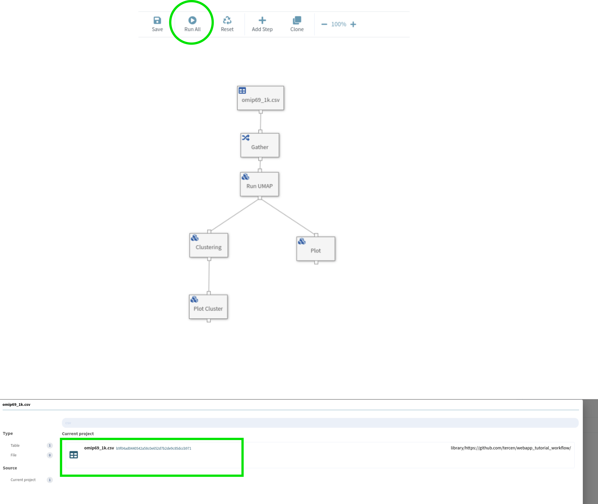

## WebApp Creation Tutorial

WebApp are bespoke user interfaces built on top of Tercen's flexible server capabilities. These UI's provide a way to group or grant easy access to common use cases, increasing productivity and reducing user training time.

This tutorial will guide in the creation of your first WebApp: the **UMAP report app**. We will start by covering the use case, briefly how this is achieved typically in Tercen and how the WebApp can change the way the user interacts with Tercen.

### 1. UMAP Report App

Our tutorial use case has three steps:

1. Upload some data
2. Run UMAP on the data
3. Download a resulting image

You can download the sample data used in the tutorial from [repository](https://github.com/tercen/webapp_tutorial_workflow).

##### 1.1. Sample Data Description

We will use the OMIP-069 1k donor [dataset](https://tercen.com/tercen/p/e0425f23e68966cc4df9df9bf6fcaa0d). The data has already been converted to the Tercen table format.

### 2. The Standard Method

If you already know how to do all steps in Tercen, you can skip straight to [section 3](#3-developing-a-webapp), otherwise let's see how to do this. You can also refer to the [Developer's Guide](https://tercen.com/explore) for a detailed view on how to take advantage of Tercen's full functionality.

##### 2.1. Project Setup

_Importing the Workflow_

A detailed overview on how to import <code>Workflow</code> GitHub repositories is described in [this video](https://www.youtube.com/watch?v=JaFlgRekJP8). In this tutorial, we will need to import [the example UMAP workflow](https://github.com/tercen/webapp_tutorial_workflow) into our library.

This workflow has 3 main features:

1. The table step to which we will link our sample data. We then convert the table from wide to long format usin the <code>Gather</code> step.
2. We then have two analysis steps: <code>Run UMAP</code> and <code>Clustering</code>.
3. Finally, we have two visualizations of the analysis. <code>Plot Cluster</code> exports the UMAP results colored by the <code>Clustering</code> results, whereas the <code>Plot</code> exports the marker value-coded UMAP coordinates.

<p>
<center></center>
<center><em>Workflow used in the tutorial.</em></center>
</p>


##### 2.2. Running the Workflow

Before diving into the WebApp creation, let's see our workflow in action. Press the 'Run All' button and select the OMIP data nad press 'Ok'.

<p>
<center></center>
<center><em>Running the Workflow. First press Run All, then select the data.</em></center>
</p>

After a few moments, the process will finish and we can inspect the images produced. Afterwards, we can open the <code>Report</code> side-view and visualize or download the produced images.


##### 2.3. Scaling

If we want to keep every workflow thas has ever been run in a project -- and the generated images -- we would need to execute these steps for every new dataset we want to analyze. That is fine if we don't do that very often. In a scenario of multiple runs per day, or multiple users, the overhead can become noticeable.

One solution to this overhead is to do as much as possible inside the operator (see HERE about developing your own operators). Fore more complex analyses, this can make workflows harder to understand and audit in the long run.

A second solution is to develop an UI handles a lot of functionality "behid the scenes", leaving the users free to focus on the analyses and results. That is exactly what WebApps do.


### 3. Developing a WebApp

WebApps are a way to provide users with a custom interaction with Tercen core functionality, automating and streamlining certain tasks. Our goal here is to build a WebApp that will allow users to more quickly execute the interactivity steps described in [section 2](#2-the-standard-method).

**NOTE:** This tutorial assumes that the Flutter SDK is correctly installed.

**NOTE 2:** We use VS Code as the development environment in this tutorial. 

##### 3.1. Repository Setup

The first step is to create a Github repository that will contain our WebApp code. Tercen provides a template for that. Select the <code>tercen/webapp_template</code> template, set the new repository to public and click on <code>Create repository</code>.
<p>
</br>
<em>Repository creation. Select <code>tercen/webapp_template</code> as the template (1). Although private repositories are supported, for the sake of simplicity, we will create a public one for this tutorial (2).</em>
</p>

Next, clone the project and in its root project run <code>flutter pub get</code> to ensure that all dependencies are satisfied.

###### 3.1.1. Overview of the WebApp project files

The project comes with a number of folders and files that we will become familiar as the tutorial goes on. For now, it suffices to know that we will create our screens under the <code>lib/screens</code> folder and register them in the <code>main.dart</code> file. 

<p>
</br>
<em>File structure of a recently created WebApp project.</em>
</p>

###### 3.1.2. Tercen Components

Tercen provides a [webapp development library](https://github.com/tercen/webapp_lib). It contains a number of functions to interact with Workflows, Projects and Users. It also wraps commonly used Widget in what we call **Components**.

**Components** have two main roles:
1. Provide reusable code so it becomes easy to add Widgets like text input or tables to your screens.

2. Integrates these Widgets with the overall WebApp architecture, automatically handling layout placement, state saving and providing a framework for interaction with the data layer.


##### 3.2. Running the WebApp

Before creating new screens, let's first see how do we run our WebApp. The standard method of running a WebApp is by pressing the **Run** button after installing the WebApp in the library. Before doing that, however, we need to build the project.

In the root folder of the project, run the <code>flutter build web</code> command. One this is done, go into the **build/web** folder and open the <code>index.html</code>. Remove the <code>\<base href="/"\></code> line. This line interferes with how Tercen serves up WebApp pages, so if it is not removed, your WebApp will not be displayed.

<p>
</br>
<em>Line to be removed before commiting the build to Github.</em>
</p>

Push the build changes to Github and install the WebApp as you would install any operator.

##### 3.3. The Upload Data Screen

_The Upload Screen Screen_

The first functionality we want to add to our Web App is the ability to upload tables into our project using a Tercen component. Let's create a file called <code>lib/screens/upload_data_screen.dart</code> containing the code from <code>base_screen_snippet.dart</code>. 

```dart
// [...] Imports


class UploadDataScreen extends StatefulWidget {
  final WebAppData modelLayer;
  const UploadDataScreen(this.modelLayer, {super.key});

  @override
  State<UploadDataScreen> createState() => _UploadDataScreenState();
}

class _UploadDataScreenState extends State<UploadDataScreen>
    with ScreenBase, ProgressDialog {
  @override
  String getScreenId() {
    return "UploadDataScreen";
  }

  @override
  void dispose() {
    super.dispose();
    disposeScreen();
  }

  @override
  void refresh() {
    setState(() {});
  }

  @override
  void initState() {
    super.initState();
    // ....

    // Component code goes here

    // ...
    initScreen(widget.modelLayer as WebAppDataBase);
  }

  @override
  Widget build(BuildContext context) {
    return buildComponents(context);
  }
}

```

Then, we insert the components we want to see on our screen. In this case, we simply need the <code>UploadTableComponent</code>.

```dart
    var uploadComponent = UploadTableComponent("uploadComp", getScreenId(), "Upload Files", 
          widget.modelLayer.app.projectId, widget.modelLayer.app.teamname);


    addComponent("default", uploadComponent);
```

That's all we need for the screen. Now, we just need to have a navigation entry to reach it. To do that, we simply point to our screen near the end of the function.


_Navigation Menu Entry_

We add the navigation in the <code>initState</code> function of <code>main.dart</code> file. 


```dart
    //The project screen
    app.addNavigationPage(
          "Project", ProjectScreen(appData, key: app.getKey("Project")));
    
    // Our new Upload Data Screen goes here!
    app.addNavigationPage(
          "Data Upload", UploadDataScreen(appData, key: app.getKey("UploadData")));
```

And that's it. We are ready to see our screen in action. We can now rebuild the project and check how it looks in action. Don't forget to remove the **base** tag from the <code>index.html</code> file before committing the changes.

###### 3.3.1. Linking a WebApp to a Workflow Template

We are going to add a different type of component to our screen: an <code>ActionComponent</code>. The <code>ActionComponent</code> adds a button that can invoke asynchronous computations. In our case, we want to run the <code>Workflow</code> we imported in [section 2.1](#21-project-setup).

_Configuring the Workflow in the WebApp_

The WebApp needs a to know how it can access workflow templates from the library. Create a new file called <code>repos.json</code> under the <code>assets</code> folder and copy the following into it:

```JSON
{
    "repos":[
        {
            "iid":"umap_workflow",
            "name":"UMAP Workflow",
            "url":"https://github.com/tercen/webapp_tutorial_workflow",
            "version":"0.1.0"
        }
    ]
}
```
Next, we tell the WebApp to load this information. First, we add this file to Flutter's pubspec file so it is loaded.

```YAML
flutter:
  uses-material-design: true

  assets:
    - assets/img/logo.png
    - assets/img/wait.webp
    - assets/repos.json
```

Finally, we read this information into the WebApp during initialization in the <code>main.dart</code> file. In the <code>initSession</code> function, we update the <code>appData.init</code> function call from

```dart
await appData.init(app.projectId, app.projectName, app.username);
```
to

```dart
await appData.init(app.projectId, app.projectName, app.username, 
    reposJsonPath:"assets/repos.json");
```

_Adding the ActionComponent_

We are ready to add a button in our screen that will run this <code>Workflow</code>.

###### 3.3.2. Adding the ActionComponent

Adding an <code>ActionComponent</code> to a screen is similar to a adding a standard <code>Component</code>. We create a <code>ButtonActionComponent</code> in the <code>init</code> function of our upload screen and add it to the action component list handled by the <code>ScreenBase</code>.

```dart
var runWorkflowBtn = ButtonActionComponent(
    "runWorkflow", "Run Analysis", _runUmap);

addActionComponent( runWorkflowBtn);

initScreen(widget.modelLayer as WebAppDataBase);
```

The <code>ButtonActionComponent</code> requires an ID, a label and the asynchronous function that will be called when the button is clicked. 

```dart
Future<void> _runUmap() async {
    
}
```

###### 3.3.3. The WorkflowRunner

The <code>Workflow</code> system in Tercen is powerful and highly flexible. The <code>WorkflowRunner</code> is a utility layer which handles the most common interactions a WebApp has with <code>Workflows</code>. Let's see step-by-step what we need to run our UMAP <code>Workflow</code>.

_Getting the Input Data_

We start by grabbing the data we uploaded from the <code>UploadTableComponent</code>. The <code>ScreenBase</code> provides a <code>getComponent</code> method that retrieves a <code>Component</code> based on its ID. Since we can upload multiple files at once, our component is a <code>MultiValueComponent</code>.

```dart
var filesComponent = getComponent("uploadComp", groupId: getScreenId()) as MultiValueComponent;

var uploadedFiles = filesComponent.getValue();

for( var uploadedFile in uploadedFiles ){
    // Setup and run the workflow
    
    // ...
}
```

The <code>getValue</code> function returns a list of <code>IdElement</code> objects, containing the uploaded files' id and name.

_Configuring the WorkflowRunner_

We create the <code>WorkflowRunner</code> object by passing the project ID, owner Id and the <code>Workflow</code> iid, as described in the <code>repos.json</code> file.

```dart
WorkflowRunner runner = WorkflowRunner(
        widget.modelLayer.project.id,
        widget.modelLayer.teamname.id,
        widget.modelLayer.getWorkflow("umap"));
```

We must link the ID of the files we updated to the <code>TableStep</code> of the <code>Workflow</code>.


##### 3.4. The Report Screen

After running the <code>Workflow</code> we are going to access its output to build a report screen.

###### 3.4.1. Adding Screen Components

We will use a <code>SelectableList(??)</code> to get a list of <code>Workflows</code>. Simply add the <code>Component</code> as we did in [section 3.3](#33-the-upload-data-screen). It will require a **fetch** parameter. Copy the code below into screen and let's see what it does.

```dart
Future<IdElementTable> fetchUmapWorkflows() async {
  var factory = tercen.ServiceFactory();

  var workflows = factory.projectObjectService.findByOwnerAndLastModified(startKey:[], endKey: []);

  var workflowColumn = workflows.map((e) => IdElement(e.id, e.name)).toList();


  var table = IdElementTable();

  return table;
}
```

The <code>fetchUmapWorkflows</code> is callback to a function which access whatever data layer our WebApp has. It can be a function which searches the project files, access a remote API or otehr similar functions. In our case, we want to search our project for <code>Workflows</code> that we have previously ran.

>NOTES
>* <code>IdElementTable</code> is a utility class which holds multiple <code>List<IdElement></code>.
>* <code>IdElement</code> itself is an utility class that holds an id and a label, both <code>String</code> objects.
>* <code>tercen.ServiceFactory</code> provides access to Tercen's API functions.

Finally, we add an <code>ActionButtonComponent</code> to call the download function when pressed.

```dart
  //TODO Code to the action component
```

###### 3.4.2. Downloading the images

To download the images, we will make calls to the Tercen API to retrieve the output of specific steps. Although not specific to WebApp development, this interaction is important for a lot of the functionality we want WebApps to have, so we will briefly go over how to access the results of a <code>Workflow</code>. 

```dart

```


